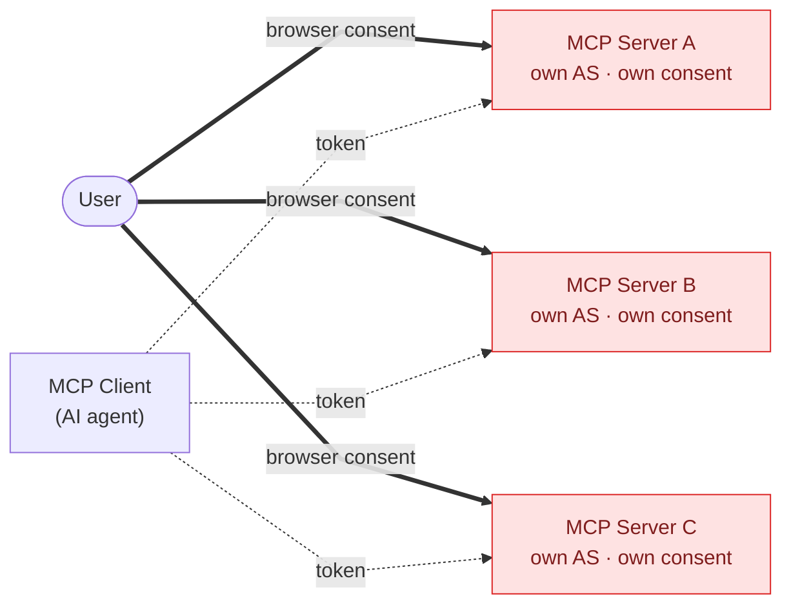
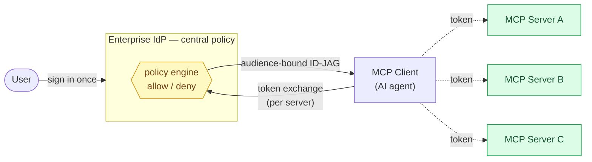

# MCP Enterprise-Managed Authorization (ID-JAG) — POC

A demo of the MCP **[Enterprise-Managed Authorization](https://modelcontextprotocol.io/extensions/auth/enterprise-managed-authorization)** extension
(`io.modelcontextprotocol/enterprise-managed-authorization`,
[SEP-990](https://modelcontextprotocol.io/seps/990-enable-enterprise-idp-policy-controls-during-mcp-o)):
centralized, IdP-driven
access control for MCP servers using the **[ID-JAG](https://datatracker.ietf.org/doc/html/draft-ietf-oauth-identity-assertion-authz-grant)** (Identity Assertion JWT Authorization Grant)
token-exchange flow.

This is the **enterprise / Azure** chapter following the earlier
[`mcp-oauth2-aws-cognito`](https://github.com/empires-security/mcp-oauth2-aws-cognito) demo
(pre-registered / DCR / CIMD client registration on AWS Cognito). Where that repo showed
*how a client gets a `client_id`*, this one shows *how the enterprise IdP centrally authorizes
access* — no per-server consent redirect.

## Why this matters for MCP

An AI agent connects to *many* MCP servers, and each one is its own OAuth-protected resource. The
classic OAuth answer — send the user through a **browser consent redirect for every server** — breaks
down at that fan-out: the access decision lives at each individual server, so the enterprise has **no
single place** to say "this user (or agent) may reach that server," to audit it, or to revoke it.
Enterprises won't let agents loose on internal systems under that model.

**Enterprise-Managed Authorization (EMA)** moves the decision to the enterprise IdP. The user signs in
**once**; when the client needs a particular MCP server, it asks the IdP over a back-channel **token
exchange**, the IdP **evaluates org policy** (directory groups, Conditional Access, …) and either mints
a short-lived, **audience-restricted** grant — the **ID-JAG** — or denies it. The payoff for MCP:

- **One central chokepoint** — IT grants, audits, and revokes agent→server access in the IdP, not
  server-by-server.
- **No per-server consent redirect** — the cross-app step is a back-channel exchange, so agents scale
  to many servers without a browser dance at each.
- **Least privilege, narrow blast radius** — each grant is bound to one server and one client and is
  short-lived, so a leaked token can't roam.
- **Real user identity preserved** — the downstream MCP server still sees the actual end-user (`sub`)
  for its own authorization and audit, not an opaque service account.

**Before — classic OAuth: a browser consent redirect at *every* server, and the access decision lives
at each server (no central control).**



**After — EMA: sign in once, and one enterprise policy engine decides access to every server.**



In short: **from per-server browser consent to central, policy-driven authorization** — the model
enterprises need before trusting agents with internal MCP servers. (ID-JAG is an emerging IETF *draft*,
not yet ratified — Okta is GA today; Entra/Google/Ping are in beta.)

## The flow

The numbered steps below are the protocol detail behind the **After** picture above. The enterprise
IdP decides access **centrally**, at the token exchange (steps 2–3); the client then takes its token
straight to the MCP server — there is **no authorization-endpoint redirect to the MCP server**. See
[`docs/diagrams.md`](docs/diagrams.md) for full sequence diagrams.

0. **Discovery** — the client calls the MCP server unauthenticated, gets a **401** with an RFC 6750
   `WWW-Authenticate` challenge, follows the `resource_metadata` pointer to the **Protected Resource
   Metadata** (RFC 9728), and from there to the **Authorization Server metadata** (RFC 8414) — learning
   the resource id, the AS, and that the AS advertises the **ID-JAG grant profile**. Nothing is hardcoded.
1. User SSOs into the MCP client against the **enterprise IdP** → ID Token (auth-code with **PKCE**;
   the client validates the **RFC 9207 `iss`** of the authorization response).
2. Client does **RFC 8693 token exchange** at the IdP → IdP **evaluates org policy** → returns an **ID-JAG**.
3. Client exchanges the ID-JAG at the **MCP Authorization Server** via **RFC 7523 jwt-bearer** → audience-restricted MCP access token.
4. Client calls the MCP Resource Server with the Bearer token.

There is **no redirect to an MCP authorization endpoint** — access is decided centrally by the IdP's
policy engine at step 2. In this POC the **`mcp-server` plays both the Authorization Server and the
Resource Server** (its AS-issuer and RFC 8707 resource id coincide); the code keeps them as separate
values so a split deployment stays conformant.

See **[`docs/diagrams.md`](docs/diagrams.md)** for the architecture and a sequence diagram of every
step, and **[`docs/spec-conformance.md`](docs/spec-conformance.md)** for a claim-by-claim conformance check
against the MCP EMA extension, the ID-JAG draft, and MCP-core authorization. For which real IdPs can
play this role today, see **[`docs/idp-support.md`](docs/idp-support.md)** (Okta is GA; Entra/Google/
Ping are in beta).

## Status

**The core POC is complete and runs end to end** — a spec-exact **mock IdP** (Node/Express + `jose`)
as the reproducible core, exercising the full discovery → SSO → token-exchange → jwt-bearer → resource
chain with both the allow and deny policy branches. A **Microsoft Entra** variant (Agent ID / OBO +
Conditional Access) is an optional later real-cloud chapter; AWS is covered as a prose comparison
(IAM Identity Center, *not* Cognito).

| Phase | Scope | State |
|---|---|---|
| 1 | mock-idp: OIDC login → ID Token + JWKS | ✅ done |
| 2 | RFC 8693 token-exchange → ID-JAG + policy engine | ✅ done |
| 3 | mcp-server AS: RFC 7523 jwt-bearer → audience-restricted access token | ✅ done |
| 4 | mcp-server RS: PRM + protected `/v1/*` (token + scope validation) | ✅ done |
| 5 | mcp-client: full chain orchestration + MCP `initialize` capability | ✅ done |
| 5b | MCP-core completeness: 401→PRM→AS-metadata discovery, PKCE, RFC 9207 `iss` | ✅ done |
| 6 | (optional) Microsoft Entra variant — build guide in [`docs/phase6-entra-guide.md`](docs/phase6-entra-guide.md) | ⏳ later |

**Run it:**
```bash
npm run install:all
npm run dev          # starts all three services (IdP :3010, MCP server :3001, client :3000)
```
Then either open **http://localhost:3000** and sign in (`eve/password` → allowed, `bob/password`
→ denied at the policy gate), or run the headless narration:
```bash
npm run demo         # runs the full chain for eve (allowed) + bob (denied) in the terminal
```

More detail in `docs/`: the [architecture and sequence diagrams](docs/diagrams.md), a claim-by-claim
[spec-conformance check](docs/spec-conformance.md), [which IdPs support this flow today](docs/idp-support.md),
and the [Microsoft Entra build guide](docs/phase6-entra-guide.md).

## License

[MIT](LICENSE)
