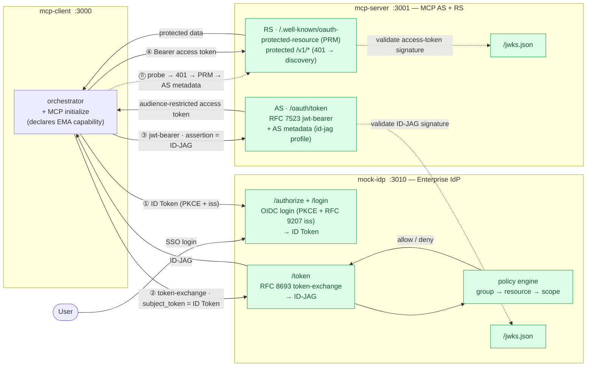
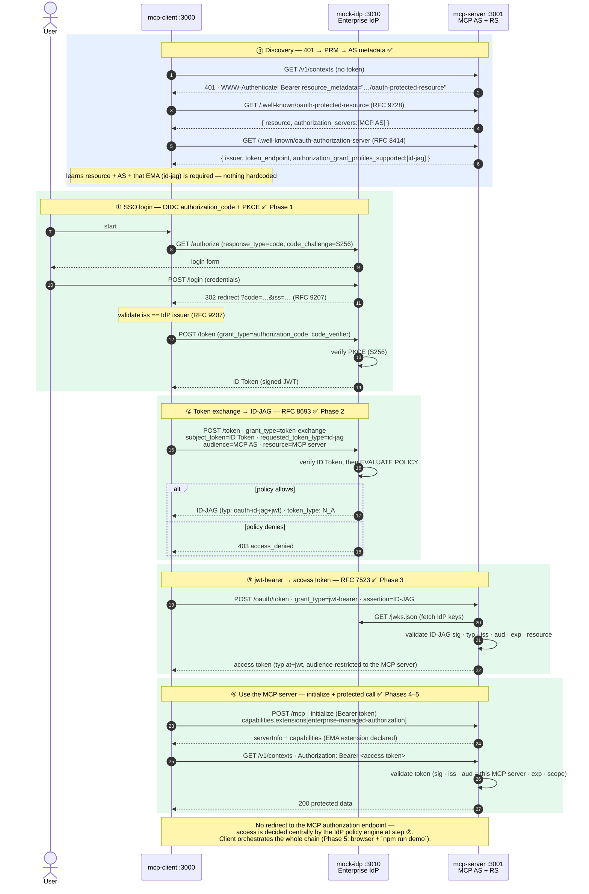
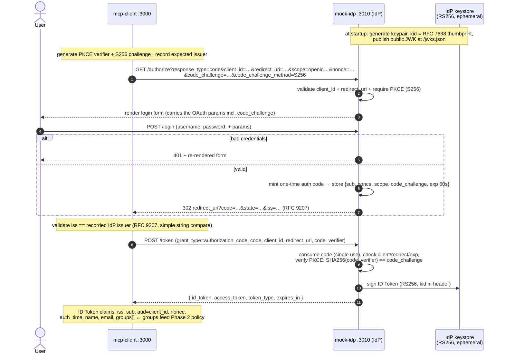
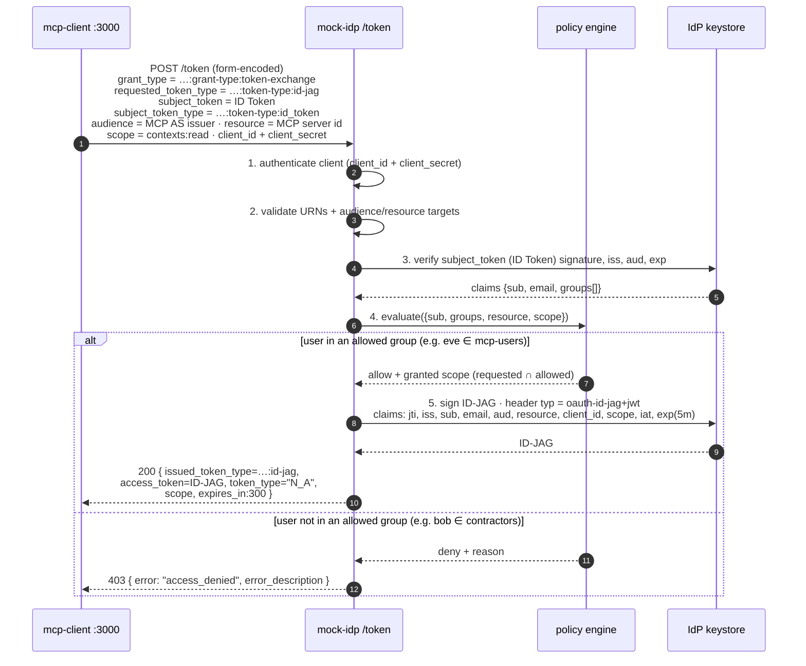
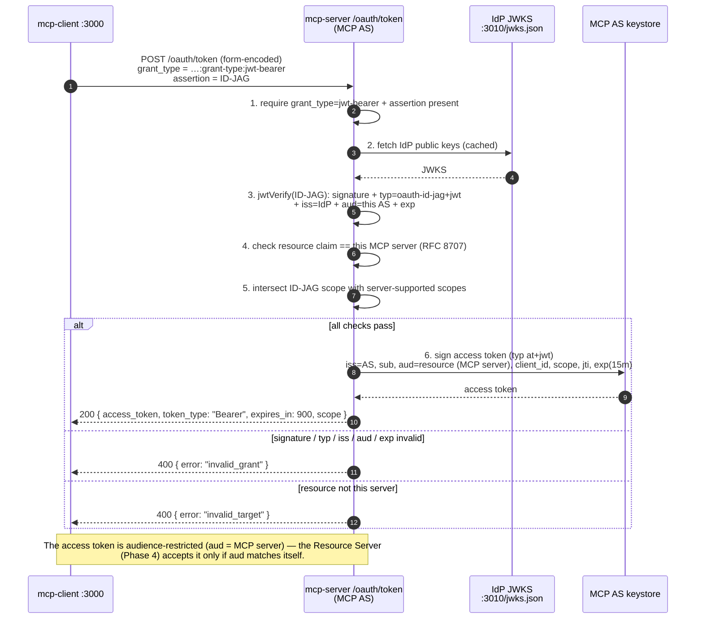
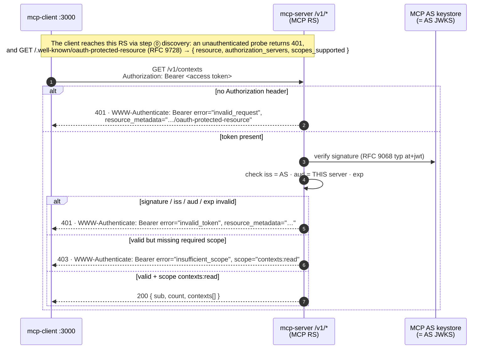

# Diagrams — MCP Enterprise-Managed Authorization (ID-JAG) POC

Visual reference for the architecture and every sequence in the flow. The fenced `mermaid` blocks
below render directly on GitHub; the raw sources also live as `.mmd` files under
[`docs/diagrams/`](diagrams/) for generating images (e.g. `mmdc -i docs/diagrams/architecture.mmd -o architecture.svg`).

Legend: **✅ built** (Phases 1–5 + MCP-core completeness — the full demo runs end to end). The headline
of the demo is that there is **no redirect to the MCP authorization endpoint** — access is decided
centrally by the IdP's policy engine during the token exchange (step ②). The client is also
**MCP-core complete**: it discovers the server via a 401 → PRM → AS-metadata loop (step ⓪) and logs in
with PKCE + RFC 9207 `iss` validation.

Pinned specs: ID-JAG `draft-ietf-oauth-identity-assertion-authz-grant-04` (21 May 2026) ·
MCP Enterprise-Managed Authorization (SEP-990) · RFC 8693 (token exchange) · RFC 7523 (JWT bearer) ·
RFC 9728 (Protected Resource Metadata) · RFC 8414 (AS metadata) · RFC 7636 (PKCE) · RFC 9207 (`iss`).

---

## 1. High-level architecture

Three Node/Express services. The MCP server plays both Authorization Server (AS) and Resource Server
(RS); its AS-issuer and resource identifier coincide in this POC. Dotted arrows are signature
validation against a published JWKS.

---

## 2. End-to-end ID-JAG chain (headline flow)

The full chain, all built. Step ⓪ is MCP-core discovery; ①–④ are the EMA legs. The MCP server is both
AS and RS (its AS-issuer and resource id coincide here).

---

## 3. Phase 1 — OIDC login → ID Token (built)

The ordinary OIDC `authorization_code` leg. Its only job is to produce an **ID Token**; the `groups`
claim it carries is what the Phase-2 policy engine decides on.

---

## 4. Phase 2 — token exchange → ID-JAG, gated by policy (built)

The core of Enterprise-Managed Authorization: the IdP, not the MCP server, decides access. `eve`
(in `mcp-users`) is allowed; `bob` (a contractor) is denied with `access_denied`. Note the exact
wire format — `token_type: "N_A"` and the `oauth-id-jag+jwt` header.

---

## 5. Phase 3 — jwt-bearer → audience-restricted access token (built)

The MCP Authorization Server redeems the ID-JAG (RFC 7523 `jwt-bearer`) for a short-lived MCP access
token. It runs no login or consent — it trusts the IdP's signature and policy decision, validates
the ID-JAG against the IdP's JWKS, and audience-restricts the issued token (`aud` = MCP server,
`typ: at+jwt`) so the Resource Server accepts it only for itself.

---

## 6. Phase 4 — Resource Server: validate token, serve protected data (built)

The Resource Server enforces the audience restriction the AS applied: a token is honoured only if its
`aud` is this server. Failures return RFC 6750 `WWW-Authenticate` challenges carrying the RFC 9728
`resource_metadata` pointer, so a client can discover the right Authorization Server.

