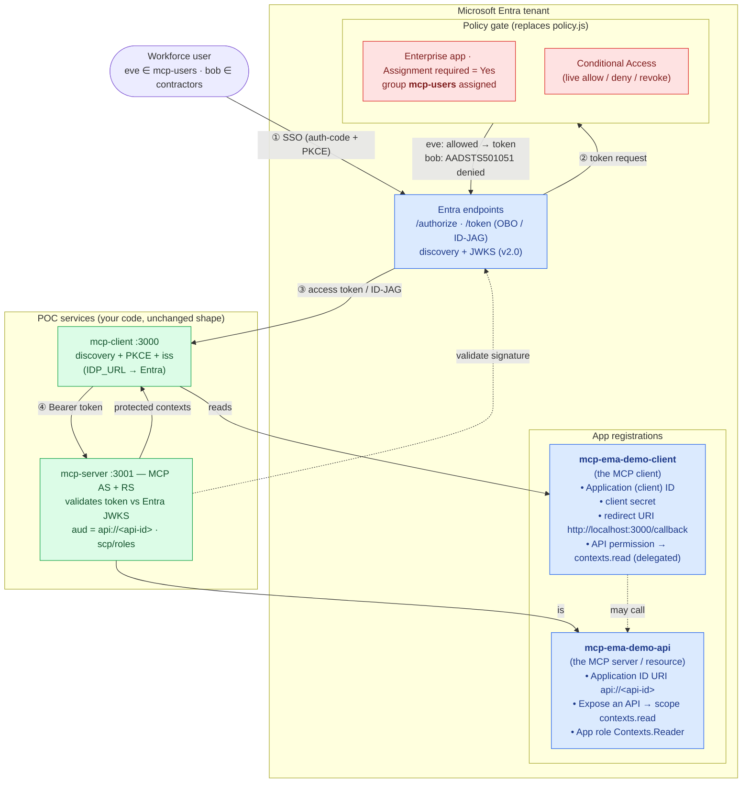

# Phase 6 — Microsoft Entra variant (the "real enterprise IdP" chapter)

> **Status: optional, later.** This is the build guide; the core demo (Phases 1–5) does **not** need
> any of this. It swaps the spec-exact `mock-idp` for **Microsoft Entra** to show the same flow on a
> real enterprise IdP — central policy gate + revocation, your tenant's real users.

## Read this first — the honest reality (June 2026)

There are **two tracks**, because Entra's *productized* token exchange today is **On-Behalf-Of (OBO)**,
**not** a spec-exact ID-JAG emitter (verified against MS Learn — see [`docs/idp-support.md`](idp-support.md)).

| Track | What it is | Available today? | Fidelity to the spec |
|---|---|---|---|
| **A — Real ID-JAG via Entra** | Entra issues `oauth-id-jag+jwt` for MCP EMA, redeemed at your MCP AS — the exact Phase 1–5 chain, just with Entra instead of `mock-idp` | ⏳ **Beta / waitlist** (Entra is a beta IdP for Claude EMA) | ✅ spec-exact when enabled |
| **B — Entra OBO approximation** | Use Entra's **OBO** as the policy-gated exchange; demonstrates the *enterprise machinery* (central allow/deny + revocation) even though the token isn't an ID-JAG | ✅ **Buildable now** (Entra Agent ID / OBO are GA) | ⚠️ approximation — OBO token, not an ID-JAG |

**Recommendation:** join the **waitlist** for Track A (below), and if you want something running before
access lands, build **Track B** and label it honestly as "the enterprise machinery, OBO-shaped — not a
spec-exact ID-JAG." Don't claim Entra emits ID-JAGs until you've re-verified on your tenant.

### Waitlist & key links
- **Join the Claude Enterprise-Managed Auth beta (gets you Entra as an IdP): https://claude.com/form/ema-waitlist**
- Entra Agent ID (GA): https://learn.microsoft.com/entra/agent-id/whats-new-agent-id
- Conditional Access for agents: https://learn.microsoft.com/entra/identity/conditional-access/agent-id
- OAuth Cross-App Access / ID-JAG: https://oauth.net/cross-app-access/

---

## ID-JAG vs OBO — why there are two tracks

Both tracks answer the same question — *how does an authenticated user become something the MCP
server will accept?* — so you **use one or the other, never both chained together.** The trap: both
use a `jwt-bearer` URN somewhere, so they look alike on the wire. They are not the same flow.

**ID-JAG** (the EMA spec's flow):
- **In:** an **ID Token** (proof of *who you are*).
- **Out:** an **ID-JAG** — `typ: oauth-id-jag+jwt`, `token_type: N_A`. **Not an access token** — a
  short-lived, signed, audience-bound *grant* meaning *"this IdP attests this user, and policy permits
  them at resource X."*
- It is then **redeemed at the MCP server's own AS** (RFC 7523 jwt-bearer), which mints the access
  token. **Two authorization servers**, cross-domain: the **resource's AS stays in charge of its own
  tokens/scopes**; the IdP only gates whether the grant is issued.

**OBO** (Entra's On-Behalf-Of flow):
- **In:** an **access token** (already issued by Entra, scoped to the calling API).
- **Out:** **another access token** for a downstream API, **still issued by Entra**, same user.
- **One authorization server** (Entra) mints both tokens; the downstream API trusts Entra directly.
  No second AS.

### Side-by-side

| | **ID-JAG** | **OBO** |
|---|---|---|
| Output | an authorization **grant** (must be redeemed) | a usable **access token** |
| Who mints the *final* access token | the **MCP server's own AS** | **Entra** (the IdP itself) |
| Authorization servers involved | **two** (IdP + resource AS) | **one** (Entra) |
| Input ("subject") | an **ID Token** / SAML assertion | an **access token** |
| Trust model | **cross-domain** — IdP and resource are different orgs with an SSO trust | **same-domain** — Entra is AS for *both* apps |
| Standard | open **IETF draft** (any IdP, any resource) | **Microsoft-specific** (Entra-only; downstream must be an Entra app) |
| Policy gate | IdP decides whether to issue the **grant** | Entra decides whether to issue the **token** (assignment / Conditional Access) |

**The one structural difference:** ID-JAG keeps the *resource server's* AS in charge of its own tokens
(the IdP only gates the grant); OBO makes the *IdP* the single authority that mints everyone's tokens.
ID-JAG bothers with the extra "grant → redeem" hop precisely because the MCP server may be a *different
company's* service — the IdP can't mint that server's tokens. OBO only works because Entra owns both
apps.

### Wire format

```
ID-JAG — step A (at the IdP):
  grant_type=urn:ietf:params:oauth:grant-type:token-exchange
  requested_token_type=...:token-type:id-jag
  subject_token=<ID Token>  subject_token_type=...:id_token
        → returns the ID-JAG  (token_type: N_A)
ID-JAG — step B (at the MCP server's AS):
  grant_type=urn:ietf:params:oauth:grant-type:jwt-bearer
  assertion=<ID-JAG>
        → returns the MCP access token

OBO — single step (at Entra):
  grant_type=urn:ietf:params:oauth:grant-type:jwt-bearer
  requested_token_use=on_behalf_of
  assertion=<access token>  scope=<downstream API>
        → returns the downstream access token (Entra-issued)
```

### So: one, the other, or both?

- **For the MCP EMA spec → ID-JAG.** This *is* the flow; OBO isn't part of the spec. (Track A; what
  `mock-idp` already does spec-exactly.)
- **For Entra *today* → OBO, as a stand-in**, because Entra doesn't yet emit ID-JAGs for self-hosting.
  But OBO **collapses the architecture**: Entra becomes the single AS, so the **MCP server's own AS leg
  disappears** — `mcp-server` becomes a pure **Resource Server** validating Entra-issued tokens. That's
  why Track B is an *approximation*: same enterprise machinery (central allow/deny + revocation),
  different token shape. (In the [architecture diagram](#architecture--entra-objects--how-the-poc-maps-onto-them)
  below, Track B means the "③ access token" arrow comes straight from Entra and the server's AS role is
  unused.)
- **Never chain them** — doing ID-JAG *and* OBO is redundant; they occupy the same slot.

**The trajectory:** Entra will support *both* — OBO (its long-standing API-chaining flow) **and**
ID-JAG (via the cross-app-access / XAA beta on the waitlist). When Entra ID-JAG lands, you switch
**Track B → Track A**: the server's AS leg comes back and the only change from the local demo is
pointing issuer/JWKS at Entra. **ID-JAG is the destination; OBO is the bridge you cross while Entra
catches up.**

---

## Architecture — Entra objects & how the POC maps onto them

Two **app registrations** (client + API), a **group**, and the **assignment / Conditional Access**
gate replace the `mock-idp`. The POC services keep their shape — only `IDP_URL`, the JWKS source, and
the exchange leg move to Entra. (Raw source: [`diagrams/phase6-entra.mmd`](diagrams/phase6-entra.mmd).)



| Entra object | Replaces (POC) | Role in the flow |
|---|---|---|
| App reg **`mcp-ema-demo-client`** | the client's `CLIENT_ID`/`CLIENT_SECRET` | the MCP client identity + redirect URI |
| App reg **`mcp-ema-demo-api`** (Expose an API + app role) | `MCP_RESOURCE` / `contexts:read` scope | the MCP server's resource id + scope/role |
| Group **`mcp-users`** + **Assignment required** | `policy.js` allow-list | static allow/deny at token issuance (eve ✓ / bob ✗) |
| **Conditional Access** | (no POC equivalent) | live central policy + revocation demo |
| Entra **/token** (OBO or ID-JAG) | `mock-idp` token-exchange | the policy-gated exchange leg |
| Entra **JWKS** (v2.0) | `mock-idp` `/jwks.json` | what `mcp-server` validates the token against |

---

## Part 1 — What you set up in Entra

These steps are common to both tracks (Track A swaps the final *exchange*; the app/identity/policy
setup is the same). You need an **Entra tenant** and at least **Cloud Application Administrator** +
the ability to manage **groups** and (for the live policy demo) **Conditional Access**.

### 1.1 Register two applications

| App registration | Plays the role of | Key settings |
|---|---|---|
| **`mcp-ema-demo-client`** | the MCP client (`src/mcp-client`) | Confidential client. **Redirect URI** (Web): `http://localhost:3000/callback`. Create a **client secret** (Certificates & secrets). Record **Application (client) ID**, **Directory (tenant) ID**, secret. |
| **`mcp-ema-demo-api`** | the MCP server / resource (`src/mcp-server`) | No redirect URI needed. **Expose an API** → set **Application ID URI** `api://<api-client-id>` → **Add a scope** `contexts.read` (Admins & users). This scope is the Entra analogue of the POC's `contexts:read`. |

### 1.2 Wire the client to the API
- In **`mcp-ema-demo-client`** → **API permissions** → **Add a permission** → **My APIs** →
  `mcp-ema-demo-api` → **Delegated permissions** → `contexts.read` → **Add**.
- **Grant admin consent** for the tenant.

### 1.3 The policy gate (this is the EMA "decision point")
This is what replaces the POC's `policy.js`. Two layers, use either or both:

1. **App-role / assignment gate (static allow/deny — the eve-vs-bob demo):**
   - Go to **Enterprise applications** → `mcp-ema-demo-api` → **Properties** → set
     **Assignment required?** = **Yes**.
   - **Users and groups** → assign the **`mcp-users`** group (create it; put "eve" in it).
   - Result: a user **not** in an assigned group (your "bob"/contractor) is **denied at token
     issuance** — Entra returns `AADSTS501051 ... isn't assigned to a role`. That's the centralized
     deny, enforced by the IdP before your MCP server is ever called.
2. **Conditional Access (the live "flip a policy → next request denied" demo):**
   - **Protection** → **Conditional Access** → new policy targeting `mcp-ema-demo-api`, grant control
     e.g. require MFA / compliant device, or **Block** for a group. Toggling this is the revocation /
     central-policy story EMA promises. For agent identities, use **Conditional Access for agents**.

### 1.4 Surface groups/roles in the token
So the MCP server can see the same signal the POC's `groups` claim carried:
- Either **App roles** (`mcp-ema-demo-api` → **App roles** → create `Contexts.Reader`, member type
  Users/Groups; assign the group) → appears as the **`roles`** claim, **or**
- **Token configuration** → **Add groups claim** → emits the **`groups`** claim (object IDs).

> Tip: prefer **app roles** over raw `groups` — role strings are stable and readable; `groups` are
> GUIDs and can hit token-bloat limits.

---

## Part 2 — What config files to change in the POC

The POC was built to make this swap small: endpoints are already env-driven (`src/shared/config.js`),
the client already does OIDC **discovery + PKCE + RFC 9207 `iss`** (all of which Entra supports), and
ID-JAG validation is already JWKS-based. Below, **bold** = the change.

### 2.1 `src/mcp-client/.env`  (and `.env.example`)
```bash
# Was: IDP_URL=http://localhost:3010
IDP_URL=https://login.microsoftonline.com/<TENANT_ID>/v2.0     # Entra v2 OIDC authority
CLIENT_ID=<client-app's Application (client) ID>
CLIENT_SECRET=<client-app secret>
# New — the API/resource the token is for:
MCP_API_SCOPE=api://<api-client-id>/contexts.read
MCP_RESOURCE=api://<api-client-id>                            # RFC 8707 resource id = the API's App ID URI
```
`IDP_URL` works unchanged with the client's `idpDiscover()` because Entra serves
`…/v2.0/.well-known/openid-configuration` (issuer, `authorization_endpoint`, `token_endpoint`,
`jwks_uri`, PKCE/`iss` support). **No code change needed for discovery.**

### 2.2 `src/mcp-server/.env`
```bash
IDP_URL=https://login.microsoftonline.com/<TENANT_ID>/v2.0    # the IdP we now trust
MCP_RESOURCE=api://<api-client-id>                            # what our tokens are audience-bound to
```

### 2.3 `src/mcp-client/flow.js`
| Function | Change | Track |
|---|---|---|
| `LOGIN_SCOPE` / `API_SCOPE` | request an Entra **access token** for the API: `openid profile <MCP_API_SCOPE>` (OBO needs an access token as the subject, not just an ID token) | B |
| `tokenExchange()` | **OBO call**: `grant_type=urn:ietf:params:oauth:grant-type:jwt-bearer`, `requested_token_use=on_behalf_of`, `assertion=<Entra access token>`, `scope=<MCP_API_SCOPE>`, `client_id`+`client_secret`. (Entra's OBO endpoint is the same `token_endpoint`.) Returns an Entra access token, **not** an ID-JAG. | B |
| `tokenExchange()` | For Track A, keep the existing RFC 8693 body but set `audience`/`resource` to the values Entra's ID-JAG profile expects (confirm in beta docs); `requested_token_type` stays `…:token-type:id-jag`. | A |
| `discover()` / PKCE / `iss` | **No change** — already MCP-core complete and Entra-compatible. | A & B |

### 2.4 `src/mcp-server/index.js`
| Spot | Change | Track |
|---|---|---|
| `IDP_JWKS` | already `createRemoteJWKSet(${IDP_ISSUER}/jwks.json)` → point at Entra's `jwks_uri` from discovery (`…/discovery/v2.0/keys`). **One line.** | A & B |
| ID-JAG `jwtVerify` (`typ: oauth-id-jag+jwt`, `issuer`, `audience`) | **Track A:** set `issuer` = Entra issuer, `audience` = your MCP AS id; keep the `typ` check (Entra ID-JAG uses `oauth-id-jag+jwt`). **Track B:** there is no separate jwt-bearer step — the MCP **RS** validates the Entra **access token** directly (`iss`=Entra, `aud`=`api://<api-client-id>`, drop the `at+jwt`/`typ` assumption, read `scp`/`roles` instead of `scope`). | A / B |
| `requireScope()` | map the POC's `contexts:read` to Entra's **`scp`** (delegated scope `contexts.read`) and/or **`roles`** claim. | A & B |
| AS `/oauth/token` (jwt-bearer) | **Track A:** unchanged in spirit — still redeems the ID-JAG. **Track B:** unused (Entra is the AS); the client calls the RS directly with the OBO/Entra token. | A / B |

### 2.5 `src/mock-idp/*`
Not run in Phase 6 — Entra replaces it. Keep it for the reproducible default; select Entra via env
(e.g. an `IDP=entra` switch or just the `.env` values above).

---

## Part 3 — What stays the same / what to verify

**Stays the same:** the client's discovery loop, PKCE, `iss` validation; the MCP server's PRM (RFC
9728) + RFC 6750 challenges + audience-restricted validation; the `initialize` EMA capability
declaration. The chain's *shape* is identical — only the IdP and the exchange leg move.

**Verify on your tenant (don't assume):**
1. Does Entra set `authorization_response_iss_parameter_supported` and return `iss` on the auth
   response? The client enforces RFC 9207 — if Entra omits `iss` but advertises support, login will
   (correctly) reject. Adjust if Entra's behavior differs.
2. **Track A only:** the exact `audience`/`resource` Entra's ID-JAG profile expects, and the ID-JAG
   claim names — re-verify against the beta docs; **do not** assume they match the mock 1:1.
3. **Track B:** confirm the OBO `assertion` is an **access token** whose `aud` is the client app
   making the OBO call (Entra rejects an ID token or a token minted for a different audience).
4. Token-bloat: if using the `groups` claim for a user in many groups, Entra may emit a `_claim_names`
   overage instead of inline groups — prefer **app roles**.

## Part 4 — Demo script (Entra)
1. Assign **eve** to `mcp-users` (allowed); leave **bob** unassigned / in `contractors` (denied).
2. Sign in as eve → token issued → MCP server returns contexts. ✅
3. Sign in as bob → **Entra denies at token issuance** (`AADSTS501051`) — no token, no MCP call. 🚫
4. **Live policy flip:** add a Conditional Access **Block** (or remove eve from `mcp-users`) →
   eve's next sign-in is denied **centrally**, with no change to the MCP server. That's the
   Enterprise-Managed Authorization pitch, on a real IdP.

---

### Sources
- Entra OBO flow (params: `grant_type=jwt-bearer`, `requested_token_use=on_behalf_of`, `assertion`): https://learn.microsoft.com/entra/identity-platform/v2-oauth2-on-behalf-of-flow
- Expose an API / scopes / app roles: https://learn.microsoft.com/entra/identity-platform/quickstart-configure-app-expose-web-apis · https://learn.microsoft.com/entra/identity-platform/howto-add-app-roles-in-apps
- Restrict token issuance via assignment (the static policy gate): https://learn.microsoft.com/entra/identity-platform/scenario-protected-web-api-expose-scopes
- Claude EMA waitlist (Entra as IdP): https://claude.com/form/ema-waitlist
